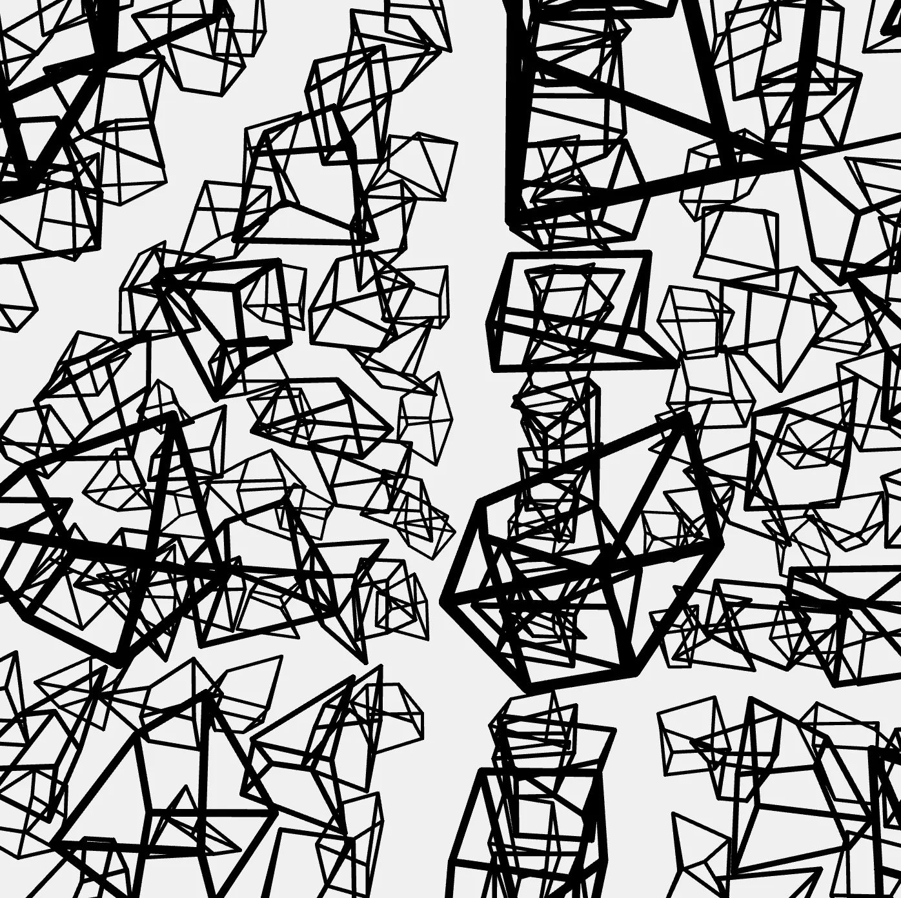
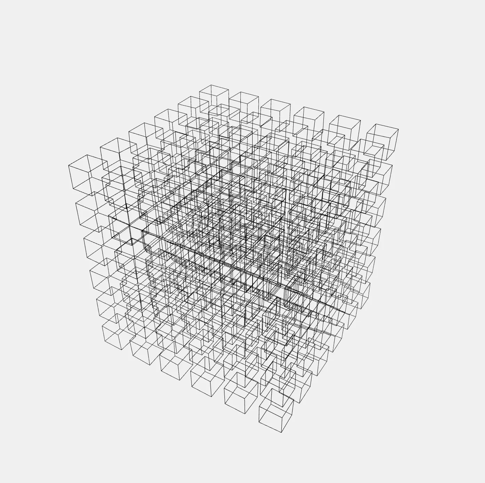
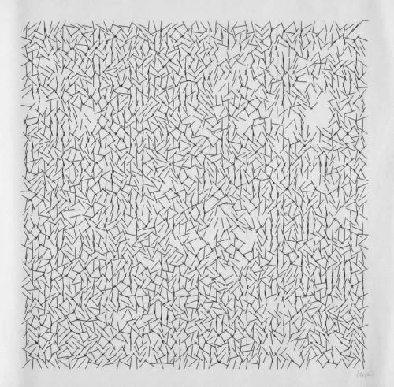
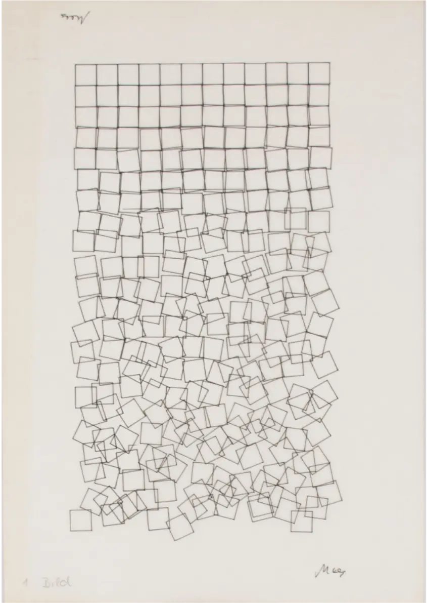
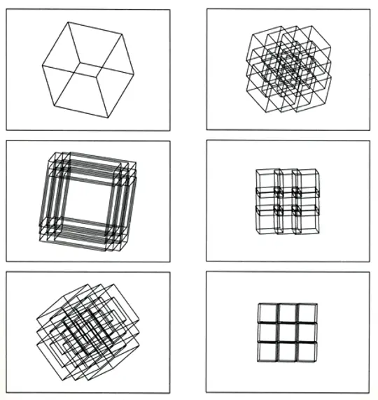

# Final Project Documentation: Breathing Cube

## Interactive sketch
<iframe src="content/final/embed1.html" width="100%" height="700" frameborder="no"></iframe>

  
  

  <em>Two stills from the final WEBGL lattice, showing the jittered wireframe cubes and the overall density.</em>

## Overview
Breathing Cube is a generative 3D sketch made with p5.js (WEBGL). It draws a lattice of wireframe cubes. Each cube looks slightly imperfect because its corners are jittered. The system slowly evolves a few parameters over time, which makes the whole structure feel like it is breathing.

Interaction is simple:
- Drag to rotate the view
- Scroll to zoom
- Press Space to freeze the simulation and inspect one moment

## Idea and goal
My goal was to create a system that stays clear and structured, but still feels alive.

I wanted a strict underlying order that never disappears, and then controlled disorder inside that order. I tried to avoid pure randomness. The viewer should still understand that there is a rule based system behind the visuals.

A simple rule I followed:
- Keep the big structure stable
- Let small details change over time

## Influences and references

### Vera Molnar: Interruptions

  

  <em>Vera Molnar, <strong>Interruptions</strong>, 1969. Black and white plotter drawing. Victoria and Albert Museum.</em>

Molnar’s idea of constructive disorder was an important reference during my weekly work. She starts with a strict geometric system and then disturbs it with controlled changes. That approach matches my process: the grid stays stable, but small deviations create expression.

### Georg Nees: Schotter (1968)

  

  <em>Georg Nees, <strong>Schotter</strong>, 1968. Systematic grid with increasing disorder.</em>

Nees shows how a grid can slowly break down while still staying readable as a grid. Even when things get messy, you can see the system. That idea influenced my decision to always keep the structure visible and only push disorder locally.

### Manfred Mohr: early hypercube explorations

  

  <em>Manfred Mohr, early cube and hypercube line systems. Structural drawing logic over realistic 3D rendering.</em>

Mohr helped me think about cubes as a graphic element instead of a realistic 3D object. His early hypercube works focus on structure and line systems. That pushed me to keep my cubes as wireframes and treat the sketch as drawing, not rendering.

### Anders Hoff (Inconvergent)
His work helped me understand controlled noise. It showed me that randomness can look clean and elegant when it is limited and applied with intention.

## Iteration process (weekly projects)

### Iteration 2: The Grid Machine
<iframe src="content/final/iteration2.html" width="100%" height="600" frameborder="no"></iframe>

In this iteration I realised I needed a rule based structure, so I introduced a grid. Each cell draws a distorted rectangle. That gave the randomness something to push against.

I built controls for:
- Grid Size
- Gap
- Irregularity
- Stroke Weight

This made exploration fast, because changing a slider instantly redrew the grid.

What did not work yet:
- The layout could become unstable
- Increasing the gap sometimes shrank the whole grid

This happened because the code tried to fit the grid into the canvas by subtracting the gaps from the total width. That changed the cell size in a way that broke the composition.

Main learning:
- Layout needs a stable framing (margins and a usable area)
- Fitting logic can create scaling bugs and make the system feel inconsistent

### Iteration 3: The Living System
<iframe src="content/final/iteration3.html" width="100%" height="600" frameborder="no"></iframe>

In the next iteration the machine became self regulating. I added an Auto Random mode where the sketch evolves on its own. The goal was that the system changes continuously, but in a controlled rhythm.

Key changes:
- The system never stops moving
- Parameters evolve smoothly instead of jumping

I had to refine the logic so it always stays active. I fixed a bug where sometimes only one parameter moved by forcing the system to always keep two active motions running.

Main learning:
- Constraints and timing are more important than adding more randomness
- Overlapping motions create organic change without chaos

## Final version: Breathing Cube (3D lattice)

### What changed compared to the weekly work
For the final piece I moved the same idea into 3D.

Instead of a 2D grid of rectangles, I draw an N×N×N lattice of cubes (N = 6, so 216 cubes). Each cube is a wireframe. The corners are jittered, which creates the same constructive disorder effect, but in space.

I also added a camera system:
- Slow auto orbit so the viewer can observe the structure
- Manual rotation and zoom
- Freeze mode to inspect a still state

## Algorithmic thinking (how it works)

### 1) Stable structure: a centred lattice
The lattice is centred inside the canvas using a margin and a fixed usable area. From that I calculate the cell size and place cubes evenly in a 3D grid.

This keeps the composition stable and readable. The structure is the anchor for everything else.

### 2) Drawing one cube: jittered vertices plus wireframe edges
A cube starts as 8 clean corner points. Then I jitter each corner based on the irregularity value. After that I draw the 12 edges as line segments.

So it stays clearly a cube, but it looks imperfect and drawn.

### 3) Stable randomness (no flicker)
I did not want the jitter to change every frame. That would look like random flicker.

To prevent this, I control randomness with a seed:
- The sketch has one global seed
- Each cube gets a deterministic per cell seed based on its x, y, z index

This makes each cube’s jitter stable over time. The form does not re roll every frame.

### 4) Autonomous evolution (the breathing motion)
The breathing effect comes from a motion system that evolves parameters over time.

Rules:
- Two parameters evolve at the same time
- When a motion ends, a new one starts, so the system never stops
- A new motion is introduced every 1800 ms
- Each motion lasts 3500 ms
- Values bounce between 0 and 100 instead of resetting

Because motions overlap, the change feels smooth and alive.

### 5) Freeze mode for inspection
Pressing Space toggles freeze:
- Simulation time stops
- Parameters stop evolving
- Auto orbit stops

But you can still rotate and zoom to inspect the frozen state. This turns the sketch into something you can study like a still object.

### 6) Camera behaviour
The camera slowly orbits the centre when you do nothing. If you drag, you take control. When you release, it eases back into the auto orbit. This keeps the sketch autonomous, but still allows exploration.

## Reflection
This process started as a random drawing tool and ended as a rule based system that feels alive.

The biggest improvement was not adding complexity, but adding clarity:
- Stable composition
- Stable randomness per cube
- Controlled evolution with timing rules

In the final version, the structure always stays readable, while the small imperfections and slow motion keep it interesting over time.

## If I had more time
- Add an export function for high resolution still images
- Optimise performance so a larger lattice size (bigger N) can run smoothly
