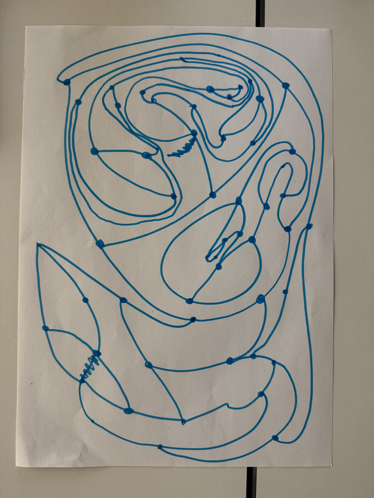

# Week 1 – Introduction & First Experiments

## Exploration and Experimentation
This week was my first real contact with generative art. We started completely analog to understand systems before touching any code.

We played a drawing game called Sprouts. It sounds simple, but it acts like a small algorithm where you follow rules and react to what happens.

After that, I moved to the online p5.js editor. I tried basic shapes and loops to recreate the feeling I got from the paper exercises. My final sketch is a small abstract composition made from random circles layered on top of each other.



<iframe src="content/week01/embed.html" width="100%" height="600" frameborder="no"></iframe>

## Influences and References
I looked at important pioneers like Vera Molnar, Georg Nees, and Sol LeWitt. They helped me see how much you can express with simple forms and clear rules.

Vera Molnar said, "My life is a system of rules". This quote really fits the idea of setting up a system and letting it run. Sol LeWitt was also influential because he gave precise instructions to let the drawing emerge from them.

## Algorithmic Thinking
I learned that analog and digital systems follow the same logic.

**Analog**
* Sprouts showed me how rules shape the drawing.
* Sol LeWitt’s instructions showed how a process can define the artwork.
* The exercises helped me see drawing as a sequence of decisions.

**Digital**
* A loop can replace repeating a step by hand.
* Random numbers add natural variation.
* Layering shapes creates complexity from simple rules.

Here is the code from my sketch:

```js
function setup() {
  createCanvas(400, 400);
  noLoop();
  for (let i = 0; i < 200; i++) {
    fill(random(255), random(255), random(255), 100);
    noStroke();
    ellipse(random(width), random(height), random(20, 80));
  }
}
```

## Reflection
The biggest thing I took away this week is how structure and randomness work together. Even simple code behaves like a system. It was cool to see that using code is just another way of following a set of rules, just like the analog games we played.