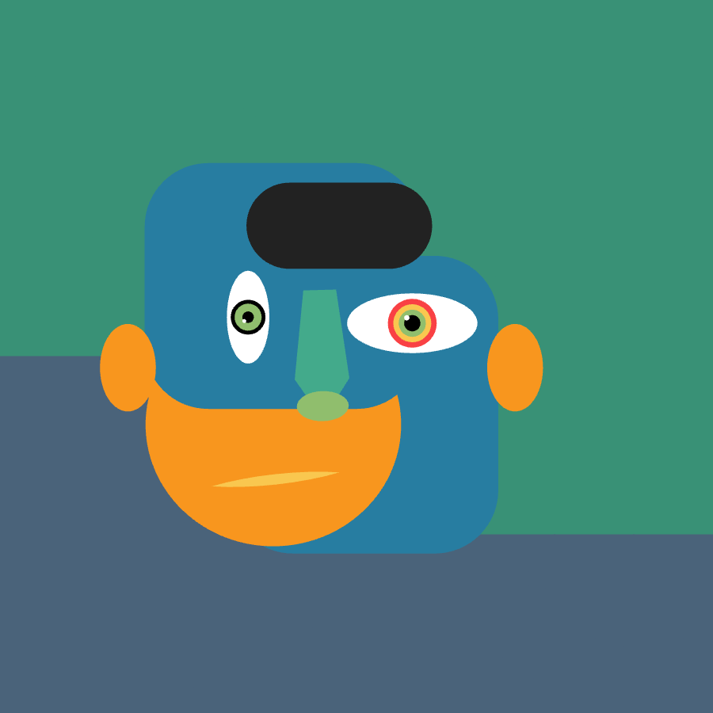
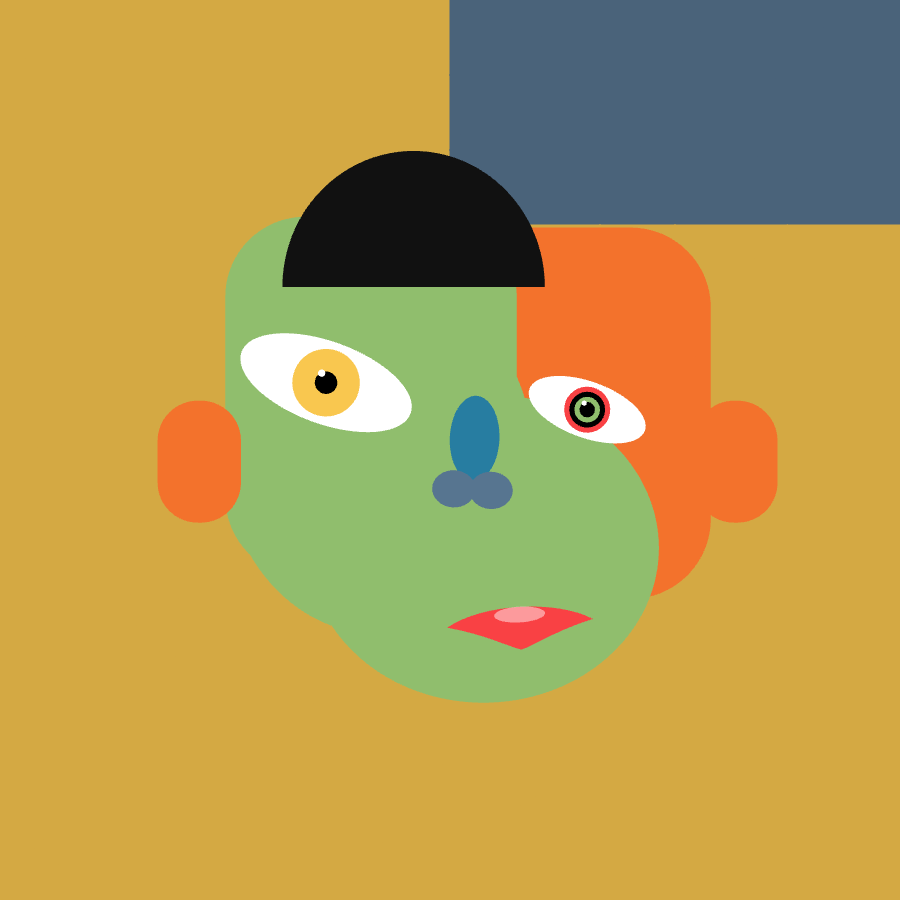
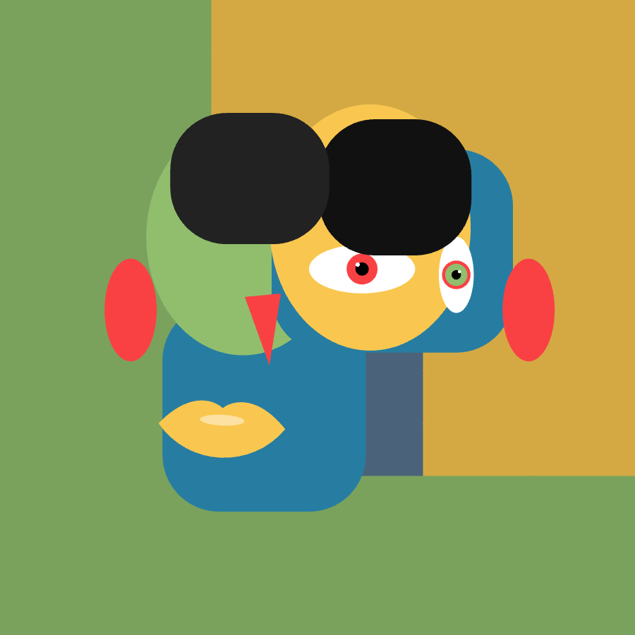
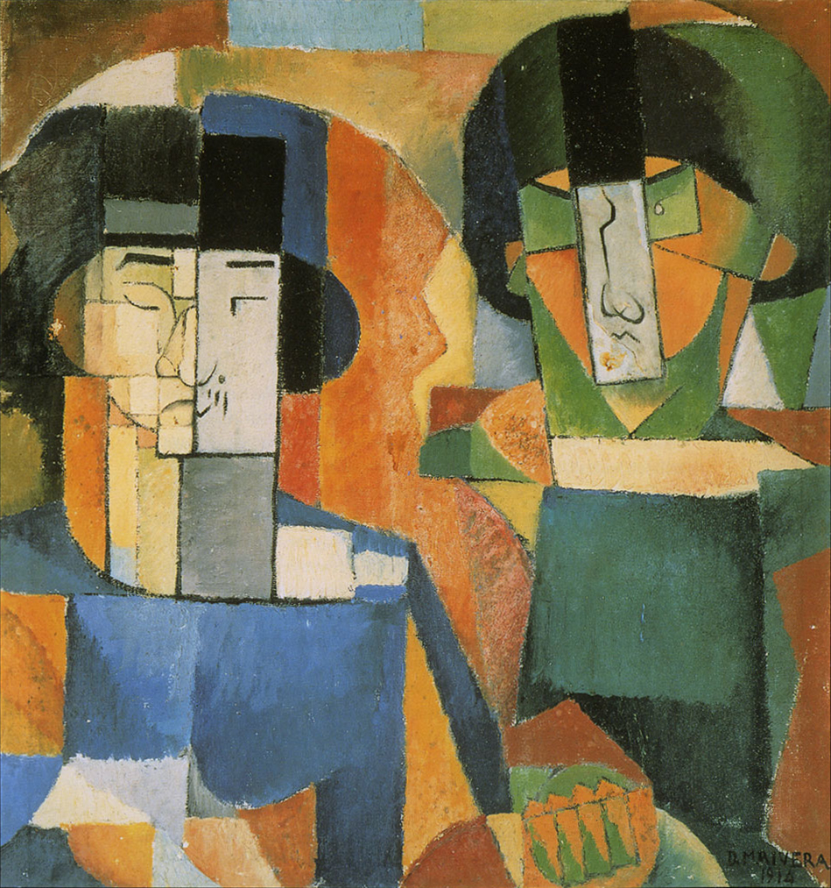
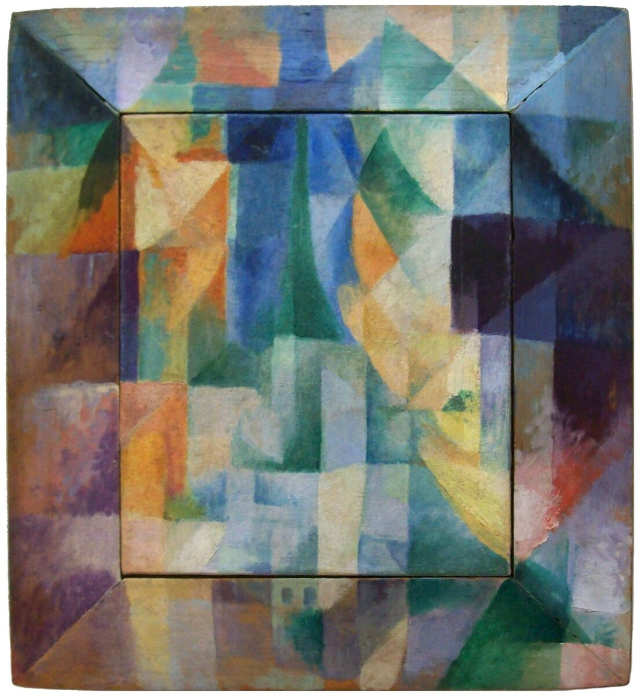

# Week 5 – Parametric Faces

## Exploration and Experimentation
This week I built a **face generator** that avoids direct drawing. Instead, every portrait emerges from a fixed set of shapes that get re-positioned, re-scaled, and re-layered. The goal was to generate strong variety while sticking to strict constraints.

**The Process**
The core idea relies on a constant catalog of forms: face tiles, eyes, noses, and hair clusters.
* **Placement:** A central face cluster emerges from tiles, with specific bands for eyes (top), nose (mid), and mouth (low).
* **Rules:** I used collision boxes to ensure features do not overlap and always stay inside the face mask.
* **Background:** The background uses the same color palette but is globally darkened so the face reads clearly in front.

<iframe src="content/week05/embed1.html" width="100%" height="900" frameborder="no"></iframe>

  
  
  

## Influences and References
My aim was to blend Cubist composition with a vibrant pop-art palette.

* **Diego Rivera (Cubism):** His collage logic and fragmented planes informed how I stacked the face layers.
* **Orphism (Windows theme):** The overlapping "window" planes inspired the clustered background and color blocks.
* **Pop-art:** I used a saturated, punchy palette to keep the compositions bold.

  
  

## Algorithmic Thinking
The system follows a strict logic to ensure the abstract shapes look like a face.

**1. Fixed Vocabulary**
No new shapes are ever created. The code only changes the position, scale, rotation, and layering of the fixed set.

**2. Mask-Based Placement**
The function `getFeaturePos()` samples random points inside a mask and uses bounding boxes (AABB) to prevent any overlap between features.

**3. Re-roll Logic**
A fresh arrangement is generated every 4 seconds, creating a new composition from the exact same building blocks.

## Reflection
This project showed me how **repetition and rearrangement** can yield huge variation. Since the shapes are fixed, the composition becomes the main tool for expression. It creates an interesting effect where the viewer's brain completes the face from abstract blocks.