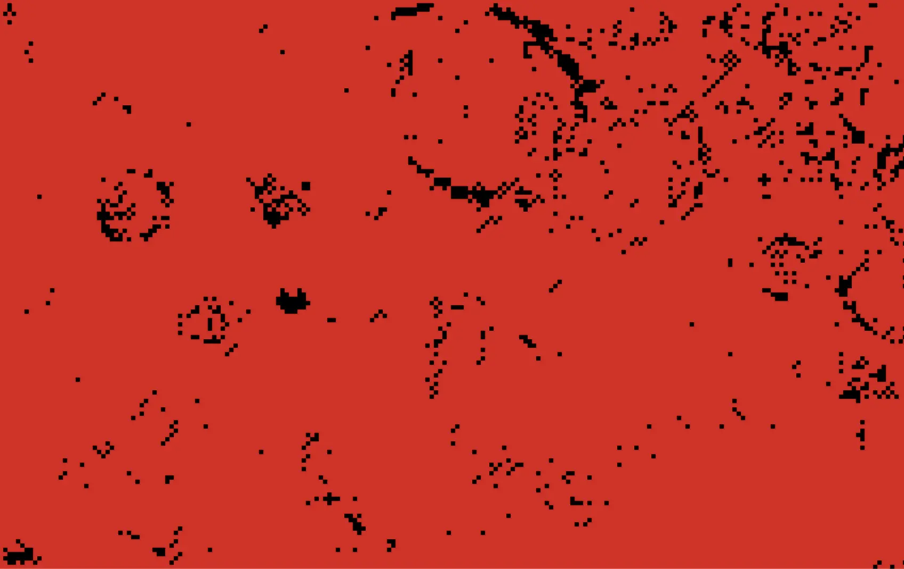
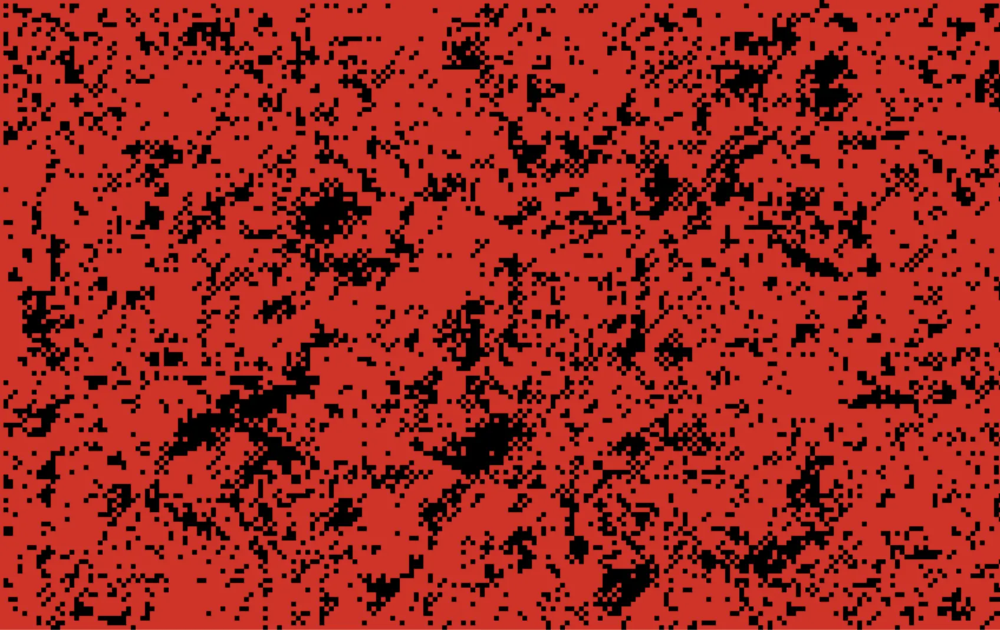

# Week 07 – Pixel Rain Waves

## Exploration & Experimentation

Goal: a **bird’s-eye view of water** where **raindrops** trigger **concentric ripples** that overlap, cancel, and recombine. Instead of cellular life rules, I used a **discrete wave field** with damping, rendered as **pixel art**.

**Why red–white–black?**
- **White** for highlights and crest lines
- **Red** for the water body (clear at low resolution)
- **Black** for steep slopes/trough accents  
The limited palette forces composition and rhythm over gradients.

**Interactions:** `SPACE` play/pause · `A` auto-rain · `R` reroll (new seed) · `C` clear · click = splash

---

## Live Demo

<iframe src="content/week07/embed.html" width="100%" height="560" frameborder="0"></iframe>

---

## Iterations

### 1) Wave Core
Two height buffers (`cur`, `prev`) updated by a **4-neighbor Laplacian** with **damping**. Animation worked, but ripples looked flat.

### 2) Light & Contrast
Per-pixel **normals** from local differences + simple Lambert term. Threshold mapping: **white** = highlight, **red** = body, **black** = steep slopes. Readability improved without losing the pixel look.

### 3) Rain & Variation
Drops are **Gaussian impulses** (clean initial rings). **Auto-rain** adds stochastic micro-impacts; **reroll** seeds broad wave fronts. Same rules, different look each run.

---

## Results (Snapshots)

<div style="display:flex; gap:10px; flex-wrap:wrap; justify-content:center; align-items:flex-start; text-align:center;">
  <figure style="margin:0;">
    
    <figcaption style="font-size:0.9em;">a) Reroll seed: overlapping ring fronts</figcaption>
  </figure>
  <figure style="margin:0;">
    
    <figcaption style="font-size:0.9em;">b) Auto-rain: interference in red–white–black</figcaption>
  </figure>
  <figure style="margin:0;">
    
    <figcaption style="font-size:0.9em;">c) Single splash: crisp edge, soft decay</figcaption>
  </figure>
</div>

---

## Algorithmic Thinking

**State:** two fields `cur[y][x]` (now), `prev[y][x]` (previous).

**Update (discrete wave with damping):**
```js
lap = (cur[y-1][x] + cur[y+1][x] + cur[y][x-1] + cur[y][x+1]) * 0.5 - prev[y][x];
next[y][x] = lap * damping; // ~0.99–0.995
```

**Drops (Gaussian impulse):**
```js
cur[yy][xx] += amp * Math.exp(-d2 / (2 * sigma * sigma)) * sign;
```

**Shading (normals + 3-tone palette):**
```js
dzdx = cur[y][x] - cur[y][x+1];
dzdy = cur[y][x] - cur[y+1][x];
n = normalize([-dzdx, -dzdy, 1]);
h = Math.max(0, dot(n, light));
color = slope>t1 ? black : (h>t2 ? white : red);
```

---

## Influences & References

- **Height-field wave solvers** as a simple, robust real-time model  
- **Minimal palettes** in pixel art (structure over shader complexity)  
- Prior **reaction–diffusion / wave-like** studies for conceptual grounding

---

## Critical Reflection

Constraining color and physics simplified decisions: **composition, timing, density**. With **reroll** and **auto-rain**, the system stays fresh without added complexity.  
Key learning: even at low resolution, **normal estimation + threshold mapping** yields strong legibility and a distinct style.
